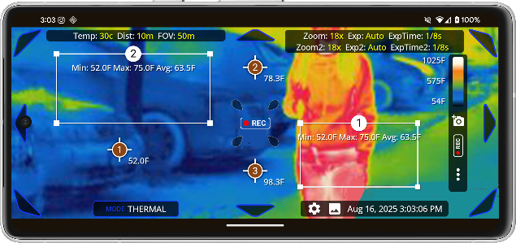
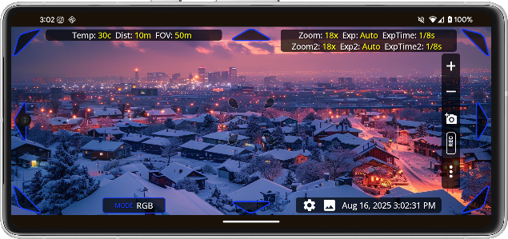

# Complex Compose Example

## YouTube Explainer

## API's used
  - Compose
  - CompositionLocal
  - Window & Display Metrics handling
  - ViewModel & Compose separation of concerns
  - StateFlow & SharedFlow
  - 30fps Animations
  - 
